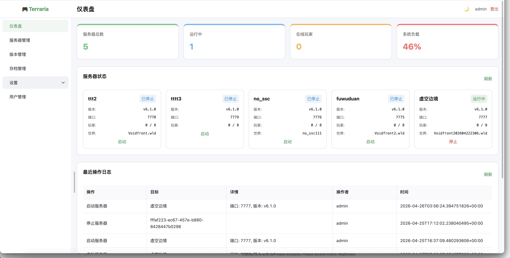
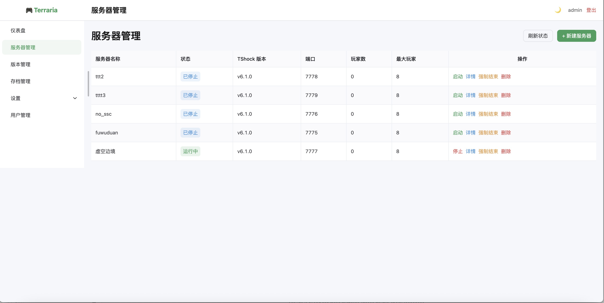
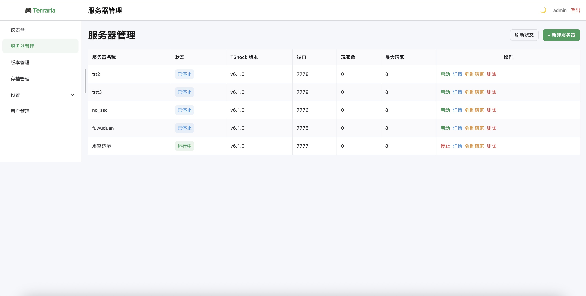
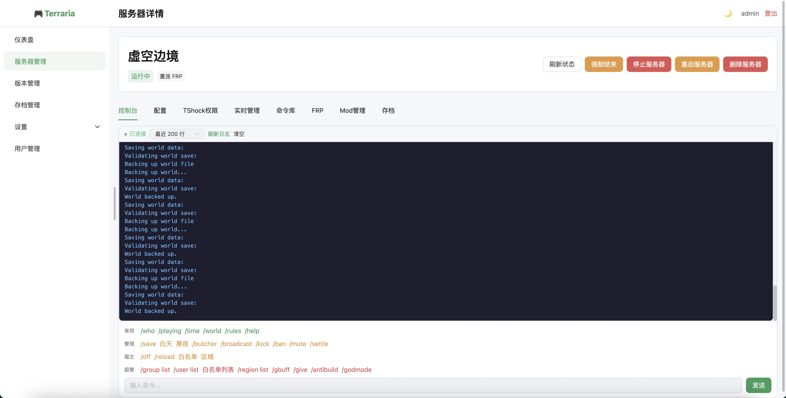
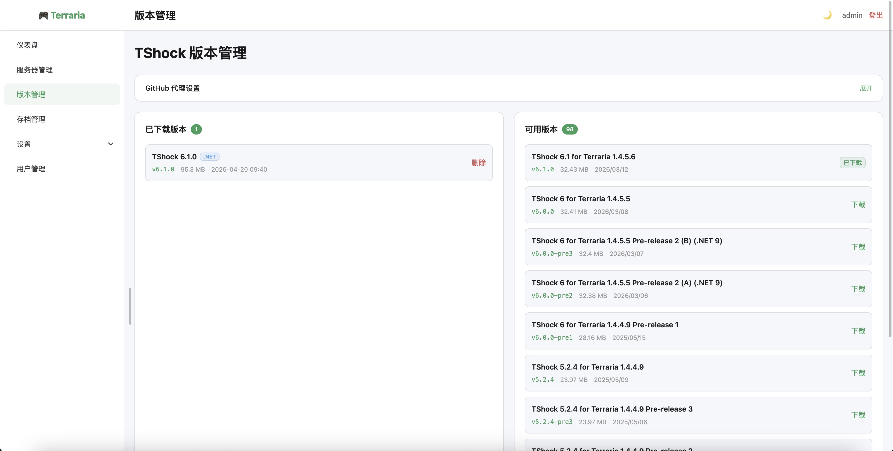
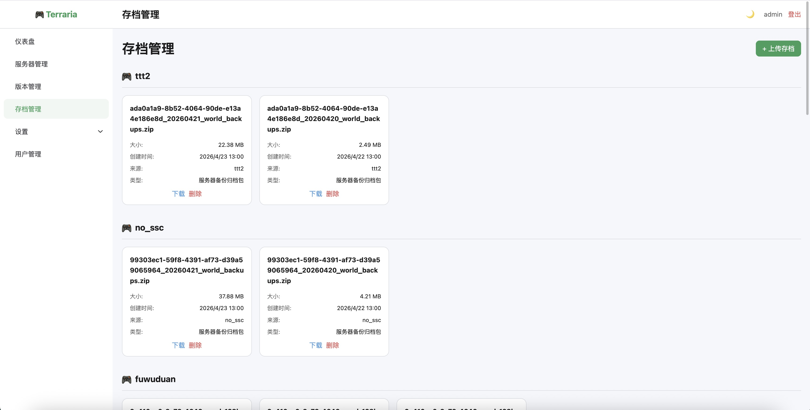
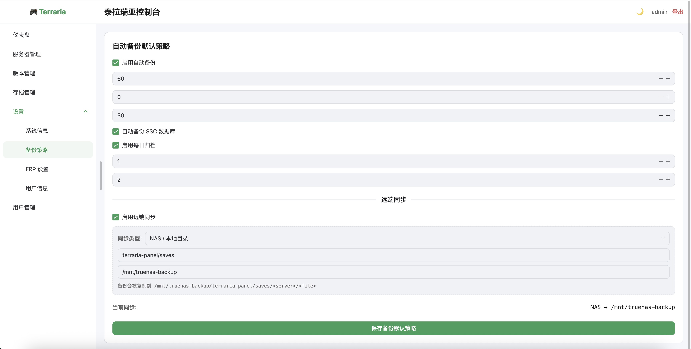
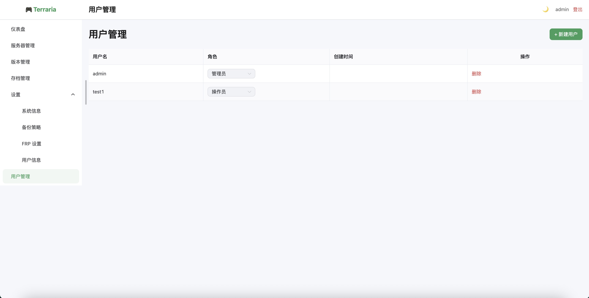

# Terraria Panel

[中文](README.md) | English

Terraria Panel is a web management panel for Terraria / TShock servers. It uses a Rust + Axum backend and a Vue 3 + TypeScript + Naive UI frontend, with server lifecycle management, live console access, TShock REST operations, save backups, FRP tunneling, and role-based user management.

> This project is still evolving. Validate it in a test environment before exposing it publicly.

## Feature Preview

### Dashboard

The dashboard shows server totals, running status, online players, system load, and recent operation logs for a quick operational overview.



### Server Management

The server list shows TShock version, port, player count, and runtime status, with quick actions for start, stop, details, force kill, and deletion.





### Server Detail And Live Console

The server detail page includes console, configuration, TShock permissions, real-time management, command library, FRP, mod management, and save tabs. The console supports live logs, command shortcuts, and command input.



### TShock Version Management

The version manager shows installed and available TShock releases, supports GitHub proxy configuration, and helps maintain multiple runtime versions.



### Saves And Backup Archives

Save management groups backup archives by server, with upload, download, and deletion support for migration, restore, and long-term retention.



### Backup Policy

Backup policy settings support automatic backups, SSC database backups, daily archiving, local retention, and remote sync to NAS/local directories or object storage.



### Users And Roles

User management supports creating and deleting users, and assigning panel roles such as administrator and operator.




## Features

- Server lifecycle management: create, start, stop, force kill, restart, and delete Terraria / TShock instances.
- Live console: stream server output over WebSocket and send console commands.
- TShock REST management: auto-provision REST tokens and manage players, users, groups, bans, world events, and broadcasts.
- Command library: parameterized TShock command execution with item and Buff selectors.
- Items and Buffs: item catalog caching, Chinese names, item delivery, configurable one-click Buffs, and active Buff cleanup.
- TShock security management: groups, permissions, SSC configuration, and role changes.
- Version management: view installed TShock builds and download available releases.
- Save management: upload, import, download, and manually back up saves.
- Automatic backups: scheduled backups, daily archives, local retention, and optional NAS / Tencent COS sync.
- FRP settings: global FRP configuration, panel tunnel, per-server tunnel recovery, and status management.
- User roles: `admin`, `operator`, and `viewer`.
- Telegram Bot: optional remote server status checks, start/stop/restart actions, and command execution.

## Tech Stack

### Backend

- Rust 2021
- Axum 0.7
- Tokio
- SQLite / rusqlite
- JWT / Argon2
- Reqwest
- WebSocket

### Frontend

- Vue 3
- TypeScript
- Vite
- Naive UI
- Pinia
- Vue Router
- Axios

## Requirements

- Linux server or development machine
- Rust stable toolchain
- Node.js 18+ and npm
- .NET Runtime for TShock 6.x
- Optional: Mono for older TShock compatibility
- Optional: frpc for FRP tunneling

## Quick Start

### 1. Clone

```bash
git clone https://github.com/your-name/terraria-panel.git
cd terraria-panel
```

### 2. Start The Backend

```bash
cd backend
cargo run
```

On first startup, the backend generates `backend/config.toml` automatically if it does not exist.

You can also provide a custom configuration path:

```bash
cd backend
TERRARIA_CONSOLE_CONFIG=./config.toml cargo run
```

Default backend URL:

```text
http://localhost:3000
```

### 3. Start The Frontend

Open another terminal:

```bash
cd frontend
npm install
npm run dev
```

Default frontend URL:

```text
http://localhost:5173
```

The Vite dev server proxies `/api` requests to `http://localhost:3000`.

### 4. Login

The first startup creates a default administrator:

```text
Username: admin
Password: admin123
```

Change the default password before production deployment.

## Production Build

### Backend

```bash
cd backend
cargo build --release
```

Output:

```text
backend/target/release/terraria-console-backend
```

### Frontend

```bash
cd frontend
npm install
npm run build
```

Output:

```text
frontend/dist
```

## Configuration

The backend reads `backend/config.toml` by default. You can override it with an environment variable:

```bash
TERRARIA_CONSOLE_CONFIG=/path/to/config.toml
```

| Section | Description |
| --- | --- |
| `[server]` | Backend host, port, data directory, and log directory |
| `[auth]` | JWT secret, token lifetime, and registration policy |
| `[tshock]` | dotnet / mono paths, GitHub mirror, and port range |
| `[telegram]` | Telegram Bot toggle, token, and allowed chat IDs |
| `[backup]` | Automatic backup, archive, and retention policy |
| `[backup.oss]` | NAS / Tencent COS remote backup settings |

Before exposing the panel publicly, update at least:

```toml
[auth]
jwt_secret = "replace-with-a-long-random-secret"
allow_register = false
```

## Project Structure

```text
.
├── backend/
│   ├── src/
│   │   ├── auth/              # JWT, password hashing, auth middleware
│   │   ├── handlers/          # Axum API handlers
│   │   ├── models/            # Data models
│   │   ├── services/          # Process, backup, FRP, TShock REST services
│   │   ├── config.rs          # Backend configuration
│   │   ├── db.rs              # SQLite initialization
│   │   └── main.rs            # Application entrypoint and routes
│   ├── config.toml            # Local configuration
│   └── data/                  # Runtime data, ignored by default
├── frontend/
│   ├── src/
│   │   ├── api/               # HTTP API wrappers
│   │   ├── components/        # Vue components
│   │   ├── constants/         # Commands, permissions, item/Buff constants
│   │   ├── router/            # Routes
│   │   ├── stores/            # Pinia stores
│   │   ├── styles/            # Global styles
│   │   └── views/             # Pages
│   └── package.json
├── images/                    # README screenshots
└── scripts/                   # Operational helper scripts
```

## Runtime Data

Runtime data is stored under `backend/data` by default.

This directory can contain server instances, TShock configuration, worlds, backups, logs, FRP runtime config, and the SQLite database. Do not commit it to a public repository.

## Development Commands

Backend:

```bash
cd backend
cargo run
cargo test
cargo check
cargo build --release
```

Frontend:

```bash
cd frontend
npm install
npm run dev
npm run build
```
